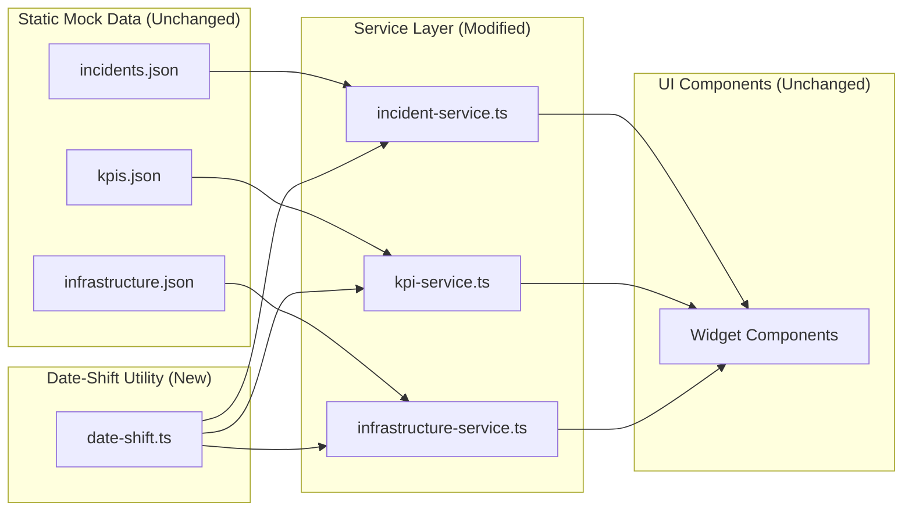

# Design Document: Date-Shifting Service Layer

**Status**: Proposed
**Date**: 2026-02-10
**Complexity Level**: Medium
**Complexity Rationale**: (1) Multiple date formats (ISO 8601, YYYY-MM-DD, YYYY-MM) across 4 service files with distinct field semantics; special recomputation logic for `daysUntilExpiry`. (2) Must be transparent to all downstream UI consumers with zero regressions.

---

## Agreement Checklist

- **Scope**: Introduce a date-shifting utility (`lib/utils/date-shift.ts`) and modify 4 service files to apply shifting at read time
- **Non-scope**: No changes to mock JSON files. No changes to UI components. No changes to type definitions. No server-side caching layer.
- **Constraints**: Must be backward-compatible with all existing widget components. Components call service functions directly and expect the same return types. No new dependencies allowed.
- **Performance requirements**: No measurable impact; shifting is pure arithmetic on small datasets (< 100 records per customer per file)

Reflection in design:
- [x] Scope covered in "Files to Create" and "Files to Modify" sections
- [x] Non-scope confirmed: JSON files, UI components, and types are not in change impact map
- [x] Constraints: return types are unchanged; no new npm packages introduced
- [x] Performance: shifting is O(n) per data array, negligible overhead on datasets of this size

---

## Applicable Standards

- `[explicit]` TypeScript strict mode (`tsconfig.json`: `"strict": true`)
- `[explicit]` Path aliases via `@/*` (`tsconfig.json`: `"paths": { "@/*": ["./*"] }`)
- `[explicit]` ESLint with Next.js core-web-vitals + TypeScript rules (`eslint.config.mjs`)
- `[implicit]` Service files export async functions taking `customerId: string` and returning typed promises
- `[implicit]` Service files import JSON data with `as` casts and use `??` for default values
- `[implicit]` No external date libraries used in the project (vanilla JS `Date` only)
- `[implicit]` Service functions are stateless: read JSON, return shaped data

---

## Prerequisite ADRs

None. No common ADRs exist in `docs/adr/`. This feature does not introduce new architectural patterns, external dependencies, or contract changes. It adds a pure utility module consumed by existing service files.

---

## Background and Problem Statement

The Transparency portal displays operational data for managed IT services. All data is sourced from static JSON files in `/data/mock/`. Every date and timestamp in these files is anchored around **February 10, 2026** -- the authoring date.

### The Staleness Problem

| Time Elapsed Since Authoring | Effect |
|------------------------------|--------|
| 0 days (Feb 10, 2026) | Data appears current |
| 7 days (Feb 17, 2026) | Recent incidents look 1 week old |
| 30 days (Mar 12, 2026) | Ticket volume chart ends 2 months ago; backup "last run" is a month stale |
| 90 days (May 11, 2026) | All data obviously outdated; certificate `daysUntilExpiry` still says 19 for a cert that should have expired |

### Specific Problems

1. **Incident timestamps freeze**: `createdAt` and `resolvedAt` never advance; open incidents look abandoned
2. **Trend charts stop**: `ticketVolume`, `mttrTrends`, and `slaHistory` end at `2026-01` regardless of current month
3. **Certificate expiry is static**: `daysUntilExpiry: 19` remains 19 forever instead of counting down
4. **Backup timestamps stale**: `lastBackup` / `nextScheduled` show Feb 10 forever
5. **Infrastructure time-series stop**: CPU, latency, throughput data anchored to early January 2026

---

## Existing Codebase Analysis

### Implementation Path Mapping

| Path | Status | Role |
|------|--------|------|
| `lib/utils/` | Does not exist | New directory for utility module |
| `lib/utils/date-shift.ts` | To be created | Date-shifting utility functions |
| `lib/services/incident-service.ts` | Existing | Modify: apply date shifting to returned data |
| `lib/services/kpi-service.ts` | Existing | Modify: apply date shifting to slaHistory months |
| `lib/services/infrastructure-service.ts` | Existing | Modify: apply date shifting to all timestamp/date fields |
| `lib/services/zero-outage-service.ts` | Existing | Inspect: confirm no date fields to shift |

### Similar Functionality Search

Searched for existing date utilities, time offset logic, and formatting helpers:
- `lib/utils/` -- directory does not exist
- No `date`, `time`, `shift`, `offset`, or `format` utility files found anywhere outside `node_modules/`
- No date manipulation in any service file (they pass through raw JSON data)
- No date manipulation in any component file (they display raw values)

**Decision**: No similar functionality exists. Proceed with new implementation.

### Existing Interface Investigation

The 4 target service files export these public functions (all take `customerId: string`):

**`incident-service.ts`** (5 functions):
- `getIncidents()` -> `Incident[]` -- contains `createdAt`, `resolvedAt`
- `getIncidentSummary()` -> `IncidentSummary[]` -- no dates
- `getTicketVolume()` -> `TicketVolume[]` -- contains `month`
- `getMttrTrends()` -> `MttrTrend[]` -- contains `month`
- `getOpenIncidents()` -> `Incident[]` -- contains `createdAt`, `resolvedAt`

**`kpi-service.ts`** (5 functions):
- `getSlaHistory()` -> `MonthlySla[]` -- contains `month`
- `getCurrentSla()` -> `number` -- no dates
- `getCosts()` -> `CostBreakdown[]` -- no dates (uses relative labels)
- `getRisk()` -> `RiskScore` -- no dates
- `getChangeSuccessRate()` -> `{ rate, trend }` -- no dates

**`infrastructure-service.ts`** (12 functions):
- `getResourceUtilization()` -> `ResourceUtilization[]` -- `timestamp` (YYYY-MM-DD)
- `getLatencyMetrics()` -> `LatencyMetric[]` -- `timestamp` (YYYY-MM-DD)
- `getNetworkThroughput()` -> `NetworkThroughput[]` -- `timestamp` (YYYY-MM-DD)
- `getCertificates()` -> `CertificateInfo[]` -- `expiresAt` (YYYY-MM-DD), `daysUntilExpiry` (number)
- `getBackups()` -> `BackupStatus[]` -- `lastBackup`, `nextScheduled` (ISO 8601)
- `getChangeCalendar()` -> `ChangeCalendarEntry[]` -- `date` (YYYY-MM-DD)
- `getErrorRates()` -> `ErrorRate[]` -- `timestamp` (YYYY-MM-DD)
- `getDnsResolution()` -> `DnsResolution[]` -- `timestamp` (YYYY-MM-DD)
- `getPatchCompliance()` -> `PatchCompliance[]` -- no dates
- `getPendingChanges()` -> `ChangeRecord[]` -- `scheduledDate` (YYYY-MM-DD)
- `getProjects()` -> `ProjectDelivery[]` -- `dueDate` (YYYY-MM-DD)
- `getServiceUtilization()` -> `ServiceUtilization[]` -- nested `months[].month` (YYYY-MM)

**`zero-outage-service.ts`** (2 functions):
- `getZeroOutageScore()` -> `ZeroOutageScore` -- no dates (scores/targets only)
- `getDigitalTransformation()` -> `DigitalTransformationMilestone[]` -- no dates (progress/status only)

**Decision on zero-outage-service.ts**: After inspection, this file contains no date fields. No modification needed.

### Code Inspection Evidence

| File | Key Functions Inspected | Relevance |
|------|------------------------|-----------|
| `lib/services/incident-service.ts` | `getIncidents`, `getTicketVolume`, `getMttrTrends`, `getOpenIncidents` | Integration point: date shifting targets |
| `lib/services/kpi-service.ts` | `getSlaHistory` | Integration point: month shifting target |
| `lib/services/infrastructure-service.ts` | All 12 exported functions | Integration point: most date fields to shift |
| `lib/services/zero-outage-service.ts` | `getZeroOutageScore`, `getDigitalTransformation` | Confirmed no date fields |
| `lib/services/cost-service.ts` | `getCostBreakdown` | Confirmed no date fields |
| `types/incident.ts` | `Incident`, `TicketVolume`, `MttrTrend` | Pattern reference: field types for date fields |
| `types/kpi.ts` | `MonthlySla`, `CostBreakdown` | Pattern reference: month field type |
| `types/infrastructure.ts` | All interfaces | Pattern reference: comprehensive date field inventory |
| `types/service.ts` | `ServiceUtilization` | Pattern reference: nested month structure |
| `data/mock/incidents.json` | Full structure | Pattern reference: actual date formats used |
| `data/mock/kpis.json` | Full structure | Pattern reference: month format confirmation |
| `data/mock/infrastructure.json` | Full structure | Pattern reference: all date/timestamp formats |
| `data/mock/zero-outage.json` | Full structure | Confirmed no dates |
| `components/widgets/technical/CertificateExpiry.tsx` | `CertificateExpiry` | Integration point: consumer of `getCertificates()` |
| `components/widgets/WidgetGrid.tsx` | `WidgetGrid` | Pattern reference: widget rendering chain |

---

## Architecture Overview

### Data Flow Diagram



### Design Principle

**Shifting happens in the service layer, not in the data or UI.** The JSON files remain the single source of truth. The service functions transform dates on every read call. UI components receive already-shifted data and require zero changes.

---

## Detailed Design

### 1. Date-Shift Utility Module

**File**: `lib/utils/date-shift.ts`

#### Anchor Date Constant

```typescript
/**
 * The date when the mock data was authored.
 * All date offsets are calculated relative to this anchor.
 */
export const ANCHOR_DATE = new Date("2026-02-10T00:00:00Z");
```

#### Core Delta Calculation

```typescript
/**
 * Returns the number of full days between the anchor date and today.
 * Returns 0 if today is on or before the anchor date.
 */
export function getDaysDelta(): number {
  const now = new Date();
  const diffMs = now.getTime() - ANCHOR_DATE.getTime();
  return Math.max(0, Math.floor(diffMs / 86_400_000));
}

/**
 * Returns the number of full months between the anchor date and today.
 * Based on calendar month difference, not exact day count.
 */
export function getMonthsDelta(): number {
  const now = new Date();
  return (
    (now.getFullYear() - ANCHOR_DATE.getFullYear()) * 12 +
    (now.getMonth() - ANCHOR_DATE.getMonth())
  );
}
```

**Rationale for `Math.max(0, ...)`**: If the code is somehow run before the anchor date, we return zero delta to avoid shifting dates backward, which would make future dates appear in the past.

#### Shifting Functions

```typescript
/**
 * Shifts an ISO 8601 timestamp (e.g., "2026-01-15T08:30:00Z") forward by the day delta.
 * Returns the shifted timestamp in the same ISO 8601 format.
 */
export function shiftISODate(isoString: string): string {
  const delta = getDaysDelta();
  if (delta === 0) return isoString;
  const date = new Date(isoString);
  date.setUTCDate(date.getUTCDate() + delta);
  return date.toISOString();
}

/**
 * Shifts a YYYY-MM-DD date string forward by the day delta.
 * Returns the shifted date in YYYY-MM-DD format.
 */
export function shiftDate(dateString: string): string {
  const delta = getDaysDelta();
  if (delta === 0) return dateString;
  const date = new Date(dateString + "T00:00:00Z");
  date.setUTCDate(date.getUTCDate() + delta);
  return date.toISOString().slice(0, 10);
}

/**
 * Shifts a YYYY-MM month string forward by the month delta.
 * Returns the shifted month in YYYY-MM format.
 */
export function shiftMonth(monthString: string): string {
  const delta = getMonthsDelta();
  if (delta === 0) return monthString;
  const [yearStr, monthStr] = monthString.split("-");
  const year = parseInt(yearStr, 10);
  const month = parseInt(monthStr, 10) - 1; // 0-indexed
  const date = new Date(Date.UTC(year, month + delta, 1));
  const shiftedYear = date.getUTCFullYear();
  const shiftedMonth = String(date.getUTCMonth() + 1).padStart(2, "0");
  return `${shiftedYear}-${shiftedMonth}`;
}

/**
 * Computes days until expiry from today for a given expiry date string (YYYY-MM-DD).
 * Returns 0 if the date has already passed.
 */
export function computeDaysUntilExpiry(shiftedExpiresAt: string): number {
  const expiry = new Date(shiftedExpiresAt + "T00:00:00Z");
  const now = new Date();
  const today = new Date(Date.UTC(now.getFullYear(), now.getMonth(), now.getDate()));
  const diffMs = expiry.getTime() - today.getTime();
  return Math.max(0, Math.ceil(diffMs / 86_400_000));
}

/**
 * Recomputes the certificate status based on the shifted daysUntilExpiry.
 */
export function computeCertificateStatus(
  daysUntilExpiry: number
): "valid" | "expiring-soon" | "expired" {
  if (daysUntilExpiry <= 0) return "expired";
  if (daysUntilExpiry <= 30) return "expiring-soon";
  return "valid";
}
```

#### Nullable Variant

```typescript
/**
 * Shifts an ISO 8601 timestamp that may be null (e.g., resolvedAt).
 * Returns null if the input is null.
 */
export function shiftISODateNullable(isoString: string | null): string | null {
  if (isoString === null) return null;
  return shiftISODate(isoString);
}
```

### 2. Service Layer Modifications

Each service file is modified to apply shifting in its return statements. The pattern is consistent: map over the returned array and apply the appropriate shift function to each date field. Return types remain identical.

#### 2a. `incident-service.ts` Changes

```typescript
import {
  shiftISODate,
  shiftISODateNullable,
  shiftMonth,
} from "@/lib/utils/date-shift";

// getIncidents: shift createdAt and resolvedAt
export async function getIncidents(customerId: string): Promise<Incident[]> {
  const incidents = data[customerId]?.incidents ?? [];
  return incidents.map((i) => ({
    ...i,
    createdAt: shiftISODate(i.createdAt),
    resolvedAt: shiftISODateNullable(i.resolvedAt),
  }));
}

// getTicketVolume: shift month
export async function getTicketVolume(customerId: string): Promise<TicketVolume[]> {
  const volume = data[customerId]?.ticketVolume ?? [];
  return volume.map((v) => ({
    ...v,
    month: shiftMonth(v.month),
  }));
}

// getMttrTrends: shift month
export async function getMttrTrends(customerId: string): Promise<MttrTrend[]> {
  const trends = data[customerId]?.mttrTrends ?? [];
  return trends.map((t) => ({
    ...t,
    month: shiftMonth(t.month),
  }));
}

// getOpenIncidents: shift createdAt and resolvedAt (same pattern)
export async function getOpenIncidents(customerId: string): Promise<Incident[]> {
  const incidents = data[customerId]?.incidents ?? [];
  return incidents
    .filter((i) => i.status === "open" || i.status === "investigating")
    .map((i) => ({
      ...i,
      createdAt: shiftISODate(i.createdAt),
      resolvedAt: shiftISODateNullable(i.resolvedAt),
    }));
}

// getIncidentSummary: no changes (no date fields)
```

#### 2b. `kpi-service.ts` Changes

```typescript
import { shiftMonth } from "@/lib/utils/date-shift";

// getSlaHistory: shift month
export async function getSlaHistory(customerId: string): Promise<MonthlySla[]> {
  const history = data[customerId]?.slaHistory ?? [];
  return history.map((h) => ({
    ...h,
    month: shiftMonth(h.month),
  }));
}

// All other functions: no changes (no date fields)
```

#### 2c. `infrastructure-service.ts` Changes

This is the most heavily modified file due to the number of date-containing data structures.

```typescript
import {
  shiftDate,
  shiftISODate,
  shiftMonth,
  computeDaysUntilExpiry,
  computeCertificateStatus,
} from "@/lib/utils/date-shift";

// getResourceUtilization: shift timestamp
export async function getResourceUtilization(customerId: string): Promise<ResourceUtilization[]> {
  const utilization = data[customerId]?.resourceUtilization ?? [];
  return utilization.map((u) => ({ ...u, timestamp: shiftDate(u.timestamp) }));
}

// getLatencyMetrics: shift timestamp
export async function getLatencyMetrics(customerId: string): Promise<LatencyMetric[]> {
  const metrics = data[customerId]?.latency ?? [];
  return metrics.map((m) => ({ ...m, timestamp: shiftDate(m.timestamp) }));
}

// getNetworkThroughput: shift timestamp
export async function getNetworkThroughput(customerId: string): Promise<NetworkThroughput[]> {
  const throughput = data[customerId]?.networkThroughput ?? [];
  return throughput.map((t) => ({ ...t, timestamp: shiftDate(t.timestamp) }));
}

// getCertificates: shift expiresAt, recompute daysUntilExpiry and status
export async function getCertificates(customerId: string): Promise<CertificateInfo[]> {
  const certs = data[customerId]?.certificates ?? [];
  return certs.map((c) => {
    const shiftedExpiry = shiftDate(c.expiresAt);
    const daysUntilExpiry = computeDaysUntilExpiry(shiftedExpiry);
    return {
      ...c,
      expiresAt: shiftedExpiry,
      daysUntilExpiry,
      status: computeCertificateStatus(daysUntilExpiry),
    };
  });
}

// getBackups: shift lastBackup and nextScheduled
export async function getBackups(customerId: string): Promise<BackupStatus[]> {
  const backups = data[customerId]?.backups ?? [];
  return backups.map((b) => ({
    ...b,
    lastBackup: shiftISODate(b.lastBackup),
    nextScheduled: shiftISODate(b.nextScheduled),
  }));
}

// getChangeCalendar: shift date
export async function getChangeCalendar(customerId: string): Promise<ChangeCalendarEntry[]> {
  const calendar = data[customerId]?.changeCalendar ?? [];
  return calendar.map((c) => ({ ...c, date: shiftDate(c.date) }));
}

// getErrorRates: shift timestamp
export async function getErrorRates(customerId: string): Promise<ErrorRate[]> {
  const rates = data[customerId]?.errorRates ?? [];
  return rates.map((r) => ({ ...r, timestamp: shiftDate(r.timestamp) }));
}

// getDnsResolution: shift timestamp
export async function getDnsResolution(customerId: string): Promise<DnsResolution[]> {
  const dns = data[customerId]?.dnsResolution ?? [];
  return dns.map((d) => ({ ...d, timestamp: shiftDate(d.timestamp) }));
}

// getPendingChanges: shift scheduledDate
export async function getPendingChanges(customerId: string): Promise<ChangeRecord[]> {
  const changes = data[customerId]?.pendingChanges ?? [];
  return changes.map((c) => ({ ...c, scheduledDate: shiftDate(c.scheduledDate) }));
}

// getProjects: shift dueDate
export async function getProjects(customerId: string): Promise<ProjectDelivery[]> {
  const projects = data[customerId]?.projects ?? [];
  return projects.map((p) => ({ ...p, dueDate: shiftDate(p.dueDate) }));
}

// getServiceUtilization: shift nested months[].month
export async function getServiceUtilization(customerId: string): Promise<ServiceUtilization[]> {
  const utilization = data[customerId]?.serviceUtilization ?? [];
  return utilization.map((s) => ({
    ...s,
    months: s.months.map((m) => ({ ...m, month: shiftMonth(m.month) })),
  }));
}

// getPatchCompliance: no changes (no date fields)
```

#### 2d. `zero-outage-service.ts` -- No Changes

After inspection, `zero-outage.json` contains only scores, targets, and pillar metrics. `digitalTransformation` contains progress percentages and statuses. No date fields exist. This file requires no modification.

---

## Date Format Inventory

| Format | Example | Fields Using It | Shift Function |
|--------|---------|----------------|----------------|
| ISO 8601 timestamp | `2026-01-15T08:30:00Z` | `createdAt`, `resolvedAt`, `lastBackup`, `nextScheduled` | `shiftISODate()` |
| YYYY-MM-DD | `2026-01-01` | `timestamp` (resource/latency/network/error/dns), `expiresAt`, `date` (calendar), `scheduledDate`, `dueDate` | `shiftDate()` |
| YYYY-MM | `2025-02` | `month` (ticketVolume, mttrTrends, slaHistory, serviceUtilization) | `shiftMonth()` |
| number (computed) | `19` | `daysUntilExpiry` | `computeDaysUntilExpiry()` |

---

## Key Design Decisions

### 1. JSON files stay untouched

The mock data files are the canonical source of truth. They can be versioned, diffed, and understood independently. Shifting is a runtime concern of the service layer.

### 2. Shifting happens in the service layer at read time

Every call to a service function recomputes the shift delta from `Date.now()`. This ensures:
- No stale cached shifts
- No startup initialization needed
- Stateless, pure transformation (aside from the clock read)

### 3. Month shifting uses calendar month delta, not day-based rounding

For YYYY-MM fields, we calculate `(currentYear - anchorYear) * 12 + (currentMonth - anchorMonth)`. This means that on March 1, 2026 the delta is 1 month, and on March 31 it is still 1 month. This keeps monthly trend charts aligned to clean month boundaries.

### 4. `daysUntilExpiry` is always recomputed, never shifted

Adding a day delta to `daysUntilExpiry` would only be correct if the `expiresAt` were also shifted by the same delta. Since we do shift `expiresAt`, we recompute `daysUntilExpiry` from the shifted expiry date relative to today. This is more robust: `daysUntilExpiry = max(0, ceil((shiftedExpiry - today) / msPerDay))`.

### 5. Certificate `status` is recomputed from the shifted `daysUntilExpiry`

The original status values (`valid`, `expiring-soon`) were set relative to the anchor date. After shifting, the `daysUntilExpiry` changes, so status must be recomputed to maintain consistency. Thresholds: `<= 0` = expired, `<= 30` = expiring-soon, `> 30` = valid.

### 6. The anchor date is a single constant

Updating the mock data authoring date requires changing exactly one constant: `ANCHOR_DATE`. All shifting cascades from this value.

### 7. No new dependencies

All date arithmetic uses native JavaScript `Date`. The project does not use `date-fns`, `luxon`, or `dayjs`, and introducing one for this use case would be disproportionate. The shifting logic is simple enough that vanilla `Date` with UTC-explicit operations is sufficient and avoids timezone surprises.

### 8. Zero delta passthrough

When `getDaysDelta()` returns 0 (running on the anchor date), all shift functions return the original string unchanged. This is an optimization and also serves as a correctness guarantee: on the authoring date, behavior is identical to the pre-shift implementation.

---

## Change Impact Map

```yaml
Change Target: Date-shifting service layer
Direct Impact:
  - lib/utils/date-shift.ts (new file: utility functions)
  - lib/services/incident-service.ts (getIncidents, getTicketVolume, getMttrTrends, getOpenIncidents modified)
  - lib/services/kpi-service.ts (getSlaHistory modified)
  - lib/services/infrastructure-service.ts (11 of 12 functions modified)
Indirect Impact:
  - All widget components consuming date fields (display shifted dates transparently)
  - Chart components rendering month-based trends (x-axis labels shift forward)
No Ripple Effect:
  - data/mock/*.json (unchanged)
  - types/*.ts (unchanged)
  - lib/services/zero-outage-service.ts (no date fields)
  - lib/services/cost-service.ts (no date fields)
  - lib/services/customer-service.ts (no date fields)
  - lib/services/service-service.ts (no date fields)
  - lib/services/security-service.ts (no date fields)
  - lib/customer-context.tsx (unchanged)
  - app/**/*.tsx (unchanged)
  - components/**/*.tsx (unchanged -- consume shifted data transparently)
```

---

## Integration Point Map

```yaml
Integration Point 1:
  Existing Component: lib/services/incident-service.ts (getIncidents, getOpenIncidents, getTicketVolume, getMttrTrends)
  Integration Method: Add import of date-shift utilities; wrap return values with .map() applying shift functions
  Impact Level: Medium (Data Transformation)
  Required Test Coverage: Verify shifted dates are valid ISO 8601 / YYYY-MM; verify null resolvedAt stays null

Integration Point 2:
  Existing Component: lib/services/kpi-service.ts (getSlaHistory)
  Integration Method: Add import of shiftMonth; wrap return value with .map()
  Impact Level: Medium (Data Transformation)
  Required Test Coverage: Verify shifted months are valid YYYY-MM; verify 12-month range ends near current month

Integration Point 3:
  Existing Component: lib/services/infrastructure-service.ts (11 functions)
  Integration Method: Add import of shift utilities; wrap return values with .map()
  Impact Level: High (Most date fields in the system; includes computed field recomputation)
  Required Test Coverage: Verify all date formats shift correctly; verify daysUntilExpiry recomputed; verify certificate status recomputed

Integration Point 4:
  Existing Component: components/widgets/technical/CertificateExpiry.tsx (and all other widgets)
  Integration Method: None (transparent consumer)
  Impact Level: Low (Read-Only -- receives shifted data without code changes)
  Required Test Coverage: Visual verification that displayed dates appear current
```

---

## Integration Boundary Contracts

```yaml
Boundary Name: date-shift.ts -> service files
  Input: Raw date string from JSON (ISO 8601, YYYY-MM-DD, or YYYY-MM)
  Output: Shifted date string in the same format (synchronous return)
  On Error: Invalid date strings will produce NaN-based output from Date constructor; services must only pass well-formed dates from validated mock data

Boundary Name: service files -> widget components
  Input: customerId string
  Output: Promise<T[]> with shifted date fields (async, same types as before)
  On Error: Returns empty array ([]) for unknown customerId (existing behavior preserved)
```

---

## Interface Change Impact Analysis

| Existing Operation | New Operation | Conversion Required | Adapter Required | Compatibility Method |
|-------------------|---------------|-------------------|------------------|---------------------|
| `getIncidents(id)` | `getIncidents(id)` | None | Not Required | Same signature, shifted data |
| `getTicketVolume(id)` | `getTicketVolume(id)` | None | Not Required | Same signature, shifted data |
| `getMttrTrends(id)` | `getMttrTrends(id)` | None | Not Required | Same signature, shifted data |
| `getOpenIncidents(id)` | `getOpenIncidents(id)` | None | Not Required | Same signature, shifted data |
| `getIncidentSummary(id)` | `getIncidentSummary(id)` | None | Not Required | Unchanged |
| `getSlaHistory(id)` | `getSlaHistory(id)` | None | Not Required | Same signature, shifted data |
| `getResourceUtilization(id)` | `getResourceUtilization(id)` | None | Not Required | Same signature, shifted data |
| `getLatencyMetrics(id)` | `getLatencyMetrics(id)` | None | Not Required | Same signature, shifted data |
| `getNetworkThroughput(id)` | `getNetworkThroughput(id)` | None | Not Required | Same signature, shifted data |
| `getCertificates(id)` | `getCertificates(id)` | None | Not Required | Same signature, shifted + recomputed data |
| `getBackups(id)` | `getBackups(id)` | None | Not Required | Same signature, shifted data |
| `getChangeCalendar(id)` | `getChangeCalendar(id)` | None | Not Required | Same signature, shifted data |
| `getErrorRates(id)` | `getErrorRates(id)` | None | Not Required | Same signature, shifted data |
| `getDnsResolution(id)` | `getDnsResolution(id)` | None | Not Required | Same signature, shifted data |
| `getPendingChanges(id)` | `getPendingChanges(id)` | None | Not Required | Same signature, shifted data |
| `getProjects(id)` | `getProjects(id)` | None | Not Required | Same signature, shifted data |
| `getServiceUtilization(id)` | `getServiceUtilization(id)` | None | Not Required | Same signature, shifted data |
| `getPatchCompliance(id)` | `getPatchCompliance(id)` | None | Not Required | Unchanged |

No interface signatures change. No adapters required. Full backward compatibility.

---

## Field Propagation Map

Fields cross from JSON -> service layer -> UI components. All fields are **preserved** (same name, same type). The value is **transformed** (shifted) at the service layer boundary.

| Field | JSON (Origin) | Service Layer | UI Component |
|-------|--------------|---------------|--------------|
| `Incident.createdAt` | Preserved (raw ISO) | Transformed (shifted ISO) | Preserved (displays shifted) |
| `Incident.resolvedAt` | Preserved (raw ISO or null) | Transformed (shifted ISO or null) | Preserved (displays shifted) |
| `TicketVolume.month` | Preserved (raw YYYY-MM) | Transformed (shifted YYYY-MM) | Preserved (displays shifted) |
| `MttrTrend.month` | Preserved (raw YYYY-MM) | Transformed (shifted YYYY-MM) | Preserved (displays shifted) |
| `MonthlySla.month` | Preserved (raw YYYY-MM) | Transformed (shifted YYYY-MM) | Preserved (displays shifted) |
| `CertificateInfo.expiresAt` | Preserved (raw YYYY-MM-DD) | Transformed (shifted YYYY-MM-DD) | Preserved (displays shifted) |
| `CertificateInfo.daysUntilExpiry` | Preserved (raw number) | Transformed (recomputed from shifted expiresAt) | Preserved (displays recomputed) |
| `CertificateInfo.status` | Preserved (raw string) | Transformed (recomputed from daysUntilExpiry) | Preserved (displays recomputed) |
| `BackupStatus.lastBackup` | Preserved (raw ISO) | Transformed (shifted ISO) | Preserved (displays shifted) |
| `BackupStatus.nextScheduled` | Preserved (raw ISO) | Transformed (shifted ISO) | Preserved (displays shifted) |
| All `*.timestamp` fields | Preserved (raw YYYY-MM-DD) | Transformed (shifted YYYY-MM-DD) | Preserved (displays shifted) |
| All `*.month` fields | Preserved (raw YYYY-MM) | Transformed (shifted YYYY-MM) | Preserved (displays shifted) |
| All `*.date` / `*.scheduledDate` / `*.dueDate` | Preserved (raw YYYY-MM-DD) | Transformed (shifted YYYY-MM-DD) | Preserved (displays shifted) |

---

## Implementation Approach

**Strategy**: Vertical Slice

**Rationale**: The date-shift utility is a single foundational module, but each service file is an independent vertical slice that can be implemented and verified in isolation. There are no inter-service dependencies for this feature. Each service can be modified, tested, and verified independently.

**Implementation Order**:

1. **Create `lib/utils/date-shift.ts`** (L2: unit tests for each shift function)
2. **Modify `incident-service.ts`** (L1: verify incident widget shows recent dates)
3. **Modify `kpi-service.ts`** (L1: verify SLA chart ends at current month)
4. **Modify `infrastructure-service.ts`** (L1: verify certificate days count down, backups show recent timestamps)
5. **Build verification** (L3: `next build` passes with zero errors)

Task 1 is the foundation; tasks 2-4 are independent of each other and could be done in parallel.

---

## Files Summary

### Files to Create

| File | Purpose |
|------|---------|
| `lib/utils/date-shift.ts` | Date-shifting utility with `ANCHOR_DATE`, `shiftISODate`, `shiftDate`, `shiftMonth`, `computeDaysUntilExpiry`, `computeCertificateStatus`, and nullable variant |

### Files to Modify

| File | Changes |
|------|---------|
| `lib/services/incident-service.ts` | Add import of shift utilities; modify `getIncidents`, `getTicketVolume`, `getMttrTrends`, `getOpenIncidents` to apply shifting |
| `lib/services/kpi-service.ts` | Add import of `shiftMonth`; modify `getSlaHistory` to apply shifting |
| `lib/services/infrastructure-service.ts` | Add import of shift utilities; modify 11 of 12 functions to apply shifting; special handling for `getCertificates` (recompute `daysUntilExpiry` and `status`) |

### Files NOT Modified (Confirmed)

| File | Reason |
|------|--------|
| `lib/services/zero-outage-service.ts` | No date fields in data |
| `lib/services/cost-service.ts` | No date fields (uses relative labels) |
| `lib/services/customer-service.ts` | No date fields |
| `lib/services/service-service.ts` | No date fields |
| `lib/services/security-service.ts` | No date fields |
| `data/mock/*.json` | Design decision: JSON stays untouched |
| `types/*.ts` | No type changes needed |
| `components/**/*.tsx` | Consume shifted data transparently |

---

## Test Strategy

### Unit Tests for `date-shift.ts`

| Test Case | Input | Expected Output |
|-----------|-------|-----------------|
| `shiftISODate` with 0 delta | `"2026-01-15T08:30:00Z"` (run on anchor date) | `"2026-01-15T08:30:00Z"` |
| `shiftISODate` with positive delta | `"2026-01-15T08:30:00Z"` (run 30 days after anchor) | `"2026-02-14T08:30:00Z"` |
| `shiftDate` with YYYY-MM-DD | `"2026-01-01"` (run 10 days after anchor) | `"2026-01-11"` |
| `shiftMonth` with month boundary | `"2026-01"` (run in March 2026) | `"2026-02"` |
| `shiftMonth` with year boundary | `"2025-02"` (run in March 2026) | `"2025-03"` |
| `shiftISODateNullable` with null | `null` | `null` |
| `computeDaysUntilExpiry` future date | `"2026-08-15"` (run on 2026-02-10) | `186` |
| `computeDaysUntilExpiry` past date | `"2026-01-01"` (run on 2026-02-10) | `0` |
| `computeCertificateStatus` valid | daysUntilExpiry = 186 | `"valid"` |
| `computeCertificateStatus` expiring | daysUntilExpiry = 19 | `"expiring-soon"` |
| `computeCertificateStatus` expired | daysUntilExpiry = 0 | `"expired"` |

### Integration Verification

| Scenario | Verification Method |
|----------|-------------------|
| Incident dates appear recent | Call `getIncidents("cust-001")`, verify `createdAt` values are within last ~40 days relative to today |
| SLA history ends at current month | Call `getSlaHistory("cust-001")`, verify last entry's `month` matches current YYYY-MM minus 1 |
| Certificate daysUntilExpiry is dynamic | Call `getCertificates("cust-001")`, verify `daysUntilExpiry` for `api.muster-ag.de` reflects actual days from today to shifted expiry |
| Backup timestamps are recent | Call `getBackups("cust-001")`, verify `lastBackup` is within last 24 hours relative to today |
| Month arrays maintain 12-month range | Call `getTicketVolume("cust-001")`, verify 12 entries spanning 12 consecutive months ending near current month |
| Build passes | Run `next build` with zero TypeScript errors |

---

## Acceptance Criteria

1. **Incident recency**: When viewing the portal on any date after 2026-02-10, incident `createdAt` timestamps appear as dates within the last ~40 days relative to today, not relative to the anchor date
2. **Trend chart currency**: `ticketVolume`, `mttrTrends`, and `slaHistory` month arrays end at or near the current month, maintaining the same 12-month trailing window
3. **Certificate countdown**: `daysUntilExpiry` decreases by 1 for each real day that passes; certificates that pass their shifted expiry show `0` days and `expired` status
4. **Backup freshness**: `lastBackup` and `nextScheduled` timestamps advance forward so they appear as today/tomorrow (matching the original relative offset from anchor)
5. **Infrastructure time-series currency**: `resourceUtilization`, `latency`, `networkThroughput`, `errorRates`, and `dnsResolution` timestamp arrays appear as recent dates
6. **Change calendar currency**: `changeCalendar` dates and `pendingChanges` scheduled dates appear as upcoming/recent dates
7. **Project due dates advance**: `projects[].dueDate` shifts forward proportionally
8. **Service utilization months advance**: Nested `serviceUtilization[].months[].month` values shift forward
9. **Mock data unchanged**: No modifications to any file in `data/mock/`
10. **Type compatibility**: No changes to any file in `types/`; all existing TypeScript interfaces remain satisfied
11. **Build passes**: `next build` completes with zero errors
12. **Zero UI changes**: No component files modified; widgets render shifted data without code changes

---

## Error Handling

The date-shift utility operates on well-formed strings from static JSON files that are under project control. There is no user input, network I/O, or dynamic data source.

**Invalid date handling**: If a malformed date string were passed to a shift function, `new Date(malformed)` would produce an `Invalid Date`, and the output would be `"NaN-NaN-NaN"` or similar. This is acceptable because:
- Mock data is statically validated by inspection
- TypeScript strict mode catches type mismatches at compile time
- No runtime validation is needed for a controlled data source

**Negative delta protection**: `getDaysDelta()` returns `Math.max(0, ...)` to prevent backward shifting if the system clock is before the anchor date.

---

## Performance Considerations

- **No measurable impact**: Each service function adds a `.map()` over arrays of 5-15 items (incidents), 12 items (monthly trends), or 14 items (daily time-series). Total operations per service call: < 200 simple `Date` arithmetic operations.
- **No caching needed**: The computation cost is negligible. Adding a cache would introduce stale-data risk (midnight rollover) with no measurable benefit.
- **Delta recalculated per call**: `getDaysDelta()` / `getMonthsDelta()` each perform one `Date.now()` call and integer arithmetic. This is intentional to ensure the delta is always current without requiring lifecycle management.

---

## Edge Cases

| Scenario | Behavior |
|----------|----------|
| Run on anchor date (2026-02-10) | Delta is 0; all functions return original strings unchanged |
| Run before anchor date | Delta clamped to 0; same as running on anchor date |
| Month boundary crossing | `shiftMonth("2025-12")` with 2-month delta yields `"2026-02"` (JavaScript Date handles month overflow) |
| Year boundary crossing | `shiftMonth("2025-02")` with 12-month delta yields `"2026-02"` |
| Leap year | `shiftDate("2026-02-28")` with 365-day delta produces `"2027-02-28"` (JavaScript Date handles correctly) |
| Certificate expiry has passed | `computeDaysUntilExpiry` returns 0; `computeCertificateStatus` returns `"expired"` |
| Null resolvedAt | `shiftISODateNullable(null)` returns `null` |

---

## References

- [TimeShift-js](https://github.com/plaa/TimeShift-js) - Library for mocking JavaScript's Date object (pattern reference, not used)
- [How wrong can a JavaScript Date calculation go?](https://philna.sh/blog/2026/01/11/javascript-date-calculation/) - Edge cases in JavaScript date arithmetic
- [Temporal API overview](https://piccalil.li/blog/date-is-out-and-temporal-is-in/) - Future-facing immutable date API (not yet widely available; vanilla Date used instead)
- [MDN Date Reference](https://developer.mozilla.org/en-US/docs/Web/JavaScript/Reference/Global_Objects/Date) - Authoritative JavaScript Date documentation
